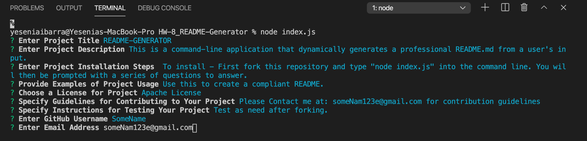

# README-GENERATOR  :computer: 


## Description

 ```
This is a command-line application that dynamically generates a professional README from user input.
 ```


  [README Example](https://github.com/YessyIbarra/HW-8_README-Generator/blob/master/newREADME.md) 

## Table of Contents
* [Description](#Description)
* [Installation](#Installation)
* [Questions](#Questions)
  

## Installation 

  ```
  To install - first fork this repository and type "node index.js" into the command/terminal line.
  You will then be prompted with a series of questions to answer. 
  NOTE: Make sure to start in correct directory before running "node index.js". 
  All dependencies are already included so no extra steps are needed
  
  If needed, please view this [Step-by-Step Tutorial](https://drive.google.com/file/d/1dXh1Zx_Y93It8SJxxmjIaRBnPoQOXUbQ/view) for more details.
  ```

## Questions

  * GitHub Username - https://github.com/YessyIbarra
  * Email - yessyibarra17@gmail.com


